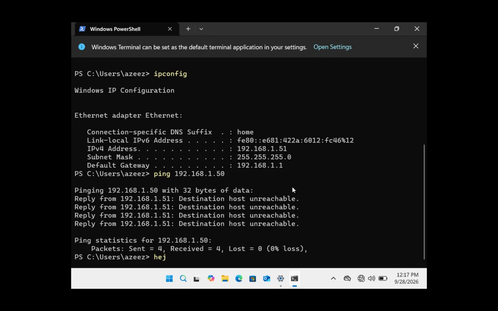
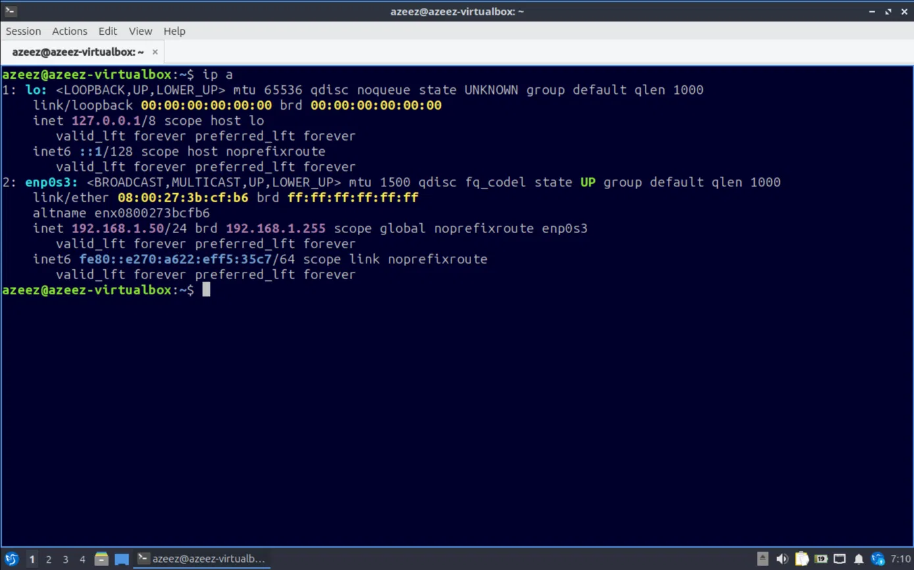
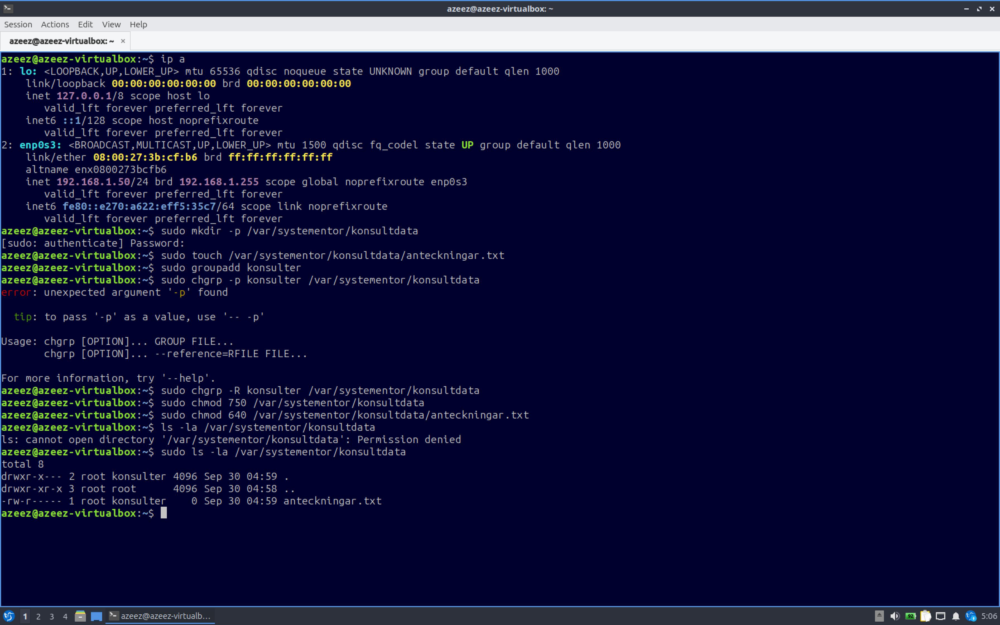
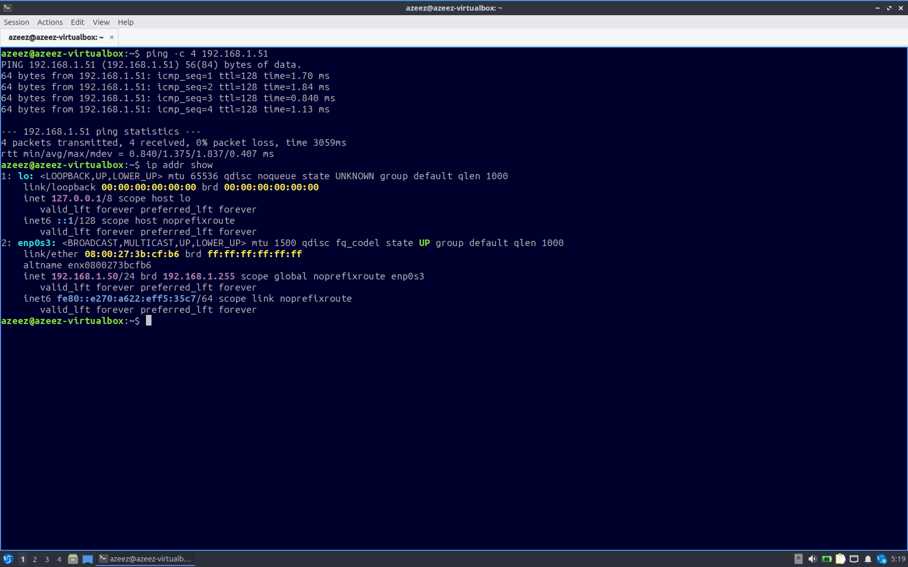
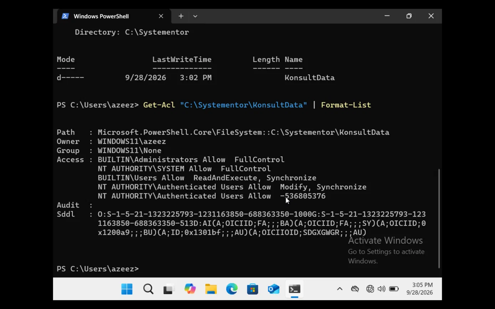
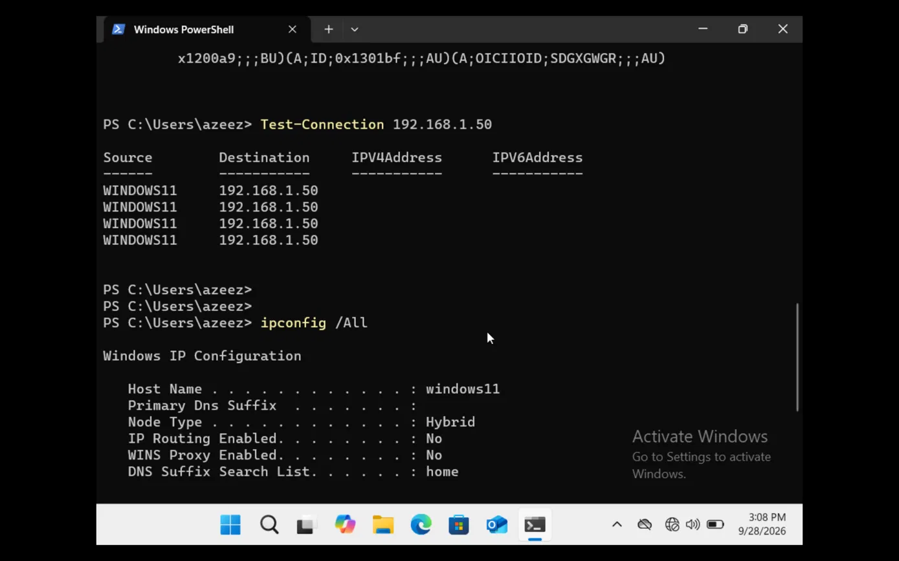
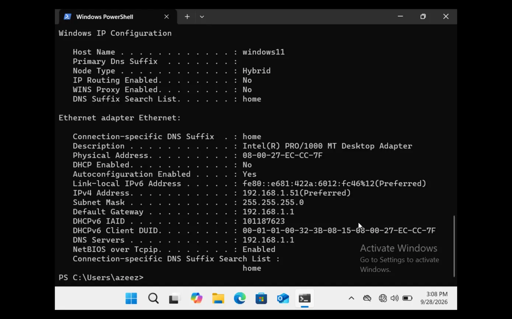

# Labbdokumentation

**Namn:** Azeez Wali

**GitHub:** azeezwali-arch

**Kurs:** IT infrastructure secure cloud - 26

**Datum:** 2026-09-15

## Innehåll
1. Del 1: Git och versionshantering
2. Del 2: Virtuell labbmiljö och nätverk
3. Del 3: Kommandoradsarbete och Felsökning
4. Del 4: AI-stöd och Kritisk Utvärdering


## Del 1: Git och versionshantering

### Installation
Jag installerade Git på min MacBook via terminalen, med hjälp av AI. Jag installerade
även Homebrew och GitHub CLI och loggade in på mitt GitHub-konto
(azeezwali-arch). 

### Arbetsgång
1. Jag skapade en ny mapp för uppgiften 
2. Jag initierade mappen som ett Git-repository med "git init".
3. Jag skapade ett repo på GitHub och kopplade det till min lokala mapp
   med "git remote add origin".
4. Jag öppnade mappen i VS Code och skapade Markdown filen
   "Labbdokumentation.md".
5. Jag committade och pushade ändringarna till GitHub.


## Del 2: Virtuell labbmiljö och nätverk

### 2.1 Miljö
Jag laddade ner VirtualBox på min MacBook och skapade två virtuella
maskiner: en Linux-maskin och en Windows 11-maskin. Jag hade inte
mycket förkunskaper, så jag tog hjälp av AI under arbetet och lärde mig
genom att prova mig fram.

Båda maskinerna sattes till "Internal Network" med namnet LabNet under
Nätverk i VirtualBox, så att de kan kommunicera med varandra men inte
med internet.

### 2.2 Miljötabell
| Hostname | Operativsystem | IP-adress | Subnätmask | Standard Gateway |
|---|---|---|---|---|
| azeez-virtualbox | Linux, Lubuntu | 192.168.1.50 | 255.255.255.0 (/24) | 192.168.1.1 |
| windows11 | Windows 11 | 192.168.1.51 | 255.255.255.0 (/24) | 192.168.1.1 |

### 2.3 Konfiguration
**Windows:** Statisk IP sattes i Inställningar → Nätverk → Ethernet:
192.168.1.51, mask 255.255.255.0, gateway 192.168.1.1.



**Linux:** Det var mycket krångligare på Linux, och jag fick mycket
hjälp av AI. IP-adressen 192.168.1.50/24 sattes först med kommandot
"ip addr add 192.168.1.50/24 dev enp0s3". Anslutningen hade ingen
sparad konfigurationsfil och "nmcli" gav felet "Message recipient
disconnected from message bus", så jag testade flera kommandon.
Till slut gav AI mig intruktionerna att skapa filen "/etc/cron.d/labip" med en rad som sätter
adressen automatiskt vid varje uppstart.



### 2.4 Test
Ping från Windows till Linux (192.168.1.50) och från Linux till
Windows (192.168.1.51) gav svar utan paketförlust.


### 2.5 Felsökning
- Ping från Linux till Windows misslyckades först, eftersom
  Windows-brandväggen blockerar ping som standard. Jag lade till en
  brandväggsregel som tillåter ICMP. AI hjälpte till med "New-NetFirewallRule -DisplayName "Allow ICMPv4 Ping" -Protocol ICMPv4 -IcmpType 8 -Action Allow"

  

- Min första Windows-fil var för ARM-processorer och fungerade inte på
  min Intel-Mac. Jag laddade ner x64-versionen.
  

## Del 3: Kommandoradsarbete och felsökning

### 3.1 Linux (Bash)

Jag skapade mappen och filen med:
```bash
sudo mkdir -p /var/systementor/konsultdata
sudo touch /var/systementor/konsultdata/anteckningar.txt
```

Sedan skapade jag en ny grupp och tilldelade den till mappen:
```bash
sudo groupadd konsulter
sudo chgrp -R konsulter /var/systementor/konsultdata
sudo chmod 750 /var/systementor/konsultdata
sudo chmod 640 /var/systementor/konsultdata/anteckningar.txt
```

**Behörigheterna enligt Least Privilege:**
- Mappen (750): ägaren (root) får läsa, skriva och gå in i mappen.
  Gruppen konsulter får läsa och gå in, men inte ändra. Övriga har
  ingen åtkomst.
- Filen (640): ägaren får läsa och skriva. Gruppen konsulter får bara
  läsa. Övriga har ingen åtkomst.

Jag kontrollerade behörigheterna med:
```bash
ls -la /var/systementor/konsultdata
```
Min egen användare är inte medlem i gruppen konsulter, så första
försöket gav "Permission denied". Det visar att behörigheterna
fungerar som tänkt, eftersom endast root och medlemmar i gruppen
konsulter har åtkomst. Med `sudo` kunde jag se att mappen och filen
ägs av root och gruppen konsulter, med rättigheterna drwxr-x---
respektive -rw-r-----.


Jag verifierade nätverket mot Windows-VM:en:
```bash
ping -c 4 192.168.1.51
ip addr show
```

Ping gav svar från alla fyra paket, och `ip addr show` bekräftade att
enp0s3 hade adressen 192.168.1.50/24.

### 3.2 Windows (PowerShell)

Jag skapade mappen:
```powershell
New-Item -ItemType Directory -Path "C:\Systementor\KonsultData" -Force
```

Jag inspekterade behörighetsstrukturen (ACL) med:
```powershell
Get-Acl "C:\Systementor\KonsultData" | Format-List
```
Resultatet visade att mappen ägs av WINDOWS11\azeez, och att
BUILTIN\Administrators och NT AUTHORITY\SYSTEM har FullControl,
BUILTIN\Users har ReadAndExecute, och Authenticated Users har Modify.
Till skillnad från Linux, som använder siffror (t.ex. 750) för
ägare, grupp och övriga, listar Windows ACL varje enskild
användare eller grupp med sina egna rättigheter.


Jag verifierade nätverket mot Linux-VM:en:
```powershell
Test-Connection 192.168.1.50
ipconfig /all
```

Test-Connection gav svar från alla fyra paket, och `ipconfig /all`
visade IPv4-adress 192.168.1.51, subnätmask 255.255.255.0 och
gateway 192.168.1.1.


### 3.3 Reflektion
Linux och Windows hanterar behörigheter på olika sätt: Linux
använder en enkel modell med ägare, grupp och övriga (uttryckt i
siffror som 750), medan Windows ACL är mer detaljerad och listar
varje användare eller grupp separat med sina egna rättigheter.
Båda systemen följer dock principen om lägsta behörighet, där
endast de som behöver åtkomst får den.


## Del 4: AI-stöd och Kritisk Utvärdering

### Använt AI-verktyg
Claude (Anthropic), via chatt.

### Prompt
"Hjälp mig med Del 3... Skapa en ny användargrupp (konsulter)...
Tilldela mappen och filen till gruppen konsulter och ställ in
behörigheter enligt principen om lägsta behörighet (t.ex. chmod 750
på mappen och 640 på filen)."

### AI-svar
Claude föreslog kommandona:
```bash
sudo groupadd konsulter
sudo chgrp -R konsulter /var/systementor/konsultdata
sudo chmod 750 /var/systementor/konsultdata
sudo chmod 640 /var/systementor/konsultdata/anteckningar.txt
```
med förklaringen att 750 ger ägaren full åtkomst, gruppen läs- och
gå-in-rättighet, och övriga ingen åtkomst, samt att 640 ger ägaren
läs/skriv och gruppen bara läsrättighet till filen.

### Kritisk granskning
Kommandona var korrekta och fungerade som beskrivet. Jag testade
själv genom att köra `ls -la` utan sudo, vilket gav "Permission
denied" eftersom min egen användare inte var medlem i gruppen
konsulter. Det bekräftade att behörigheten 750 verkligen blockerar
åtkomst för alla utom root och gruppen konsulter, precis som AI:n
förklarade. Jag hittade ingen felaktig information i svaret.

Ett litet misstag inträffade dock när jag själv skrev `chgrp -p`
istället för `chgrp -R`, vilket gav ett felmeddelande. Det var mitt
eget skrivfel snarare än ett fel i AI:ns instruktion, men det visar
vikten av att läsa felmeddelanden noga och inte bara klistra in
kommandon utan att förstå dem.

### Verifiering
Jag verifierade svaret genom att faktiskt köra kommandona i min
Linux-VM och kontrollera resultatet med `ls -la`, som visade
rättigheterna `drwxr-x---` för mappen och `-rw-r-----` för filen,
precis som förväntat enligt 750 och 640. Jag jämförde också
förklaringen mot min egen kunskap om att chmod-siffror representerar
läs (4), skriv (2) och kör (1) i tre positioner (ägare, grupp,
övriga), vilket stämde.